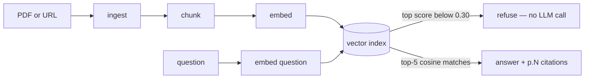

# doclens

Upload a PDF or paste a link. Ask questions. Get answers cited to the page — with retrieval
quality measured, not vibed.

[](https://github.com/nagendernss/doclens/actions/workflows/ci.yml)
[](LICENSE)

## Quickstart

```bash
pip install -e .
export GEMINI_API_KEY=...        # free: https://aistudio.google.com/apikey
doclens ask paper.pdf "what's the main result?"
```

Windows PowerShell: `$env:GEMINI_API_KEY="..."` · Windows cmd: `set GEMINI_API_KEY=...` instead
of `export`.

```
doclens ask <path-or-url> "<question>" [--model gemini-3.1-flash-lite] [-k 5]
doclens models                                    # list models, * = key present
```

A URL works the same way as a local file — PDF link or webpage, both get the same SSRF-guarded
fetch path:

```bash
doclens ask https://example.com/some-article "what does it say about X?"
```

## Live demo

**[doclens-05fb.onrender.com](https://doclens-05fb.onrender.com/)** — upload a PDF or paste a link,
then ask. Free tier: a few ingests + questions per day per visitor (bring your own Gemini key to
bypass). First request after idle may take ~30s while the free dyno wakes; sessions reset on restart.

**Chat mode:** each document keeps its own conversation — ask follow-up questions ("and their
email?" after "what's the name?") and the model carries the prior turns as context, still answering
only from the retrieved chunks. Click any `[p.N]` citation to jump to and highlight the source chunk
it came from. Conversations live in your browser (localStorage), not the server.

## How it works

Deep dive: [design spec](docs/superpowers/specs/2026-07-14-doclens-design.md) ·
[core plan](docs/superpowers/plans/2026-07-14-doclens-core.md) · [web plan](docs/superpowers/plans/2026-07-14-doclens-web.md).



| Stage | Module | What it does |
|---|---|---|
| Ingest | `doclens/ingest.py`, `doclens/ingest_url.py` | PDF (`pypdf`) or URL (`httpx` + `selectolax`) → a `Document` of per-page text; SSRF guard on every URL |
| Chunk | `doclens/chunker.py` | Sliding window, ~2,000 chars (~500 tokens) per chunk, 15% overlap, snapped back to a sentence boundary up to 80 chars earlier |
| Embed | `doclens/providers/gemini.py` | Batches of ≤64 chunks → `gemini-embedding-001` vectors, with 429/5xx retry |
| Index | `doclens/index.py` | Hand-built numpy `VectorIndex` — L2-normalize rows, dot product = cosine, top-k |
| Answer | `doclens/answer.py` | Embed the question, retrieve top-5, build a context-only prompt, cite `[p.N]` per claim, refuse below the score threshold |

The answer prompt is deliberately narrow: "use only the context chunks below, cite every claim as
`[p.N]`, and if the context doesn't contain the answer, reply starting with exactly `Not in the
document.`" Citations are extracted from the model's own output with a regex
(`\[p\.(\d+)\]`), not trusted blindly — the eval harness later checks every citation actually
points at a chunk that was retrieved.

Shape of a run (illustrative — see [Evals](#evals) for real numbers; this is not a captured live
transcript):

```
$ doclens ask evals/corpus/device-manual.md "What voltage and wattage does the BX-9 require?"
doclens · device-manual.md · 3 pages · 6 chunks
retrieved: p.1, p.1, p.2, p.2, p.3

The Boreal SmartBrew BX-9 requires 120V at 60Hz and draws 1350W [p.1]. Do not operate it on any
other voltage or frequency [p.1].

model=gemini-3.1-flash-lite tokens=147+31
```

## Evals

<!-- evals:start -->
| Model | Mode | Recall@5 | MRR | Faithful | Refusal acc | p50 s |
|-------|------|----------|-----|----------|-------------|-------|
| gemini-3.1-flash-lite | dense | 1.00 | 0.86 | 100.0% | 100.0% | 1.33 |
| gemini-3.1-flash-lite | hybrid | 1.00 | 0.83 | 100.0% | 100.0% | 1.34 |
| gemini-3.1-flash-lite | hybrid_rerank | 1.00 | 0.68 | 100.0% | 100.0% | 2.07 |
<!-- evals:end -->

**Three retrieval modes, measured side by side.** `dense` is cosine-only; `hybrid` fuses dense
with a hand-built BM25 index via Reciprocal Rank Fusion; `hybrid_rerank` adds an LLM listwise
reranker over the fused pool. The server defaults to **`hybrid`** — the eval below says why.

> 📝 **Write-up:** [When LLM Reranking *Hurt* My RAG (and the eval that caught it)](docs/blog/when-llm-reranking-hurt-my-rag.md) — the story behind these numbers.

**What the numbers say (honestly).** recall@5 saturates at 1.00 for every mode (small corpus,
`k=5` — see the caveat below), so **MRR** carries the retrieval-quality signal. Splitting it by
query type is where it gets interesting:

| query type | dense | hybrid | hybrid_rerank |
|------------|-------|--------|---------------|
| semantic (24 cases) | **0.858** | 0.819 | 0.638 |
| exact-term probe (5 cases) | 0.900 | 0.900 | 0.900 |

- **Hybrid** costs ~0.03 aggregate MRR versus dense on this semantic-heavy set. That cost buys
  BM25 exact-string matching (error codes, IDs, rare tokens) that dense embeddings blur — a
  robustness property this small, semantic-leaning corpus under-measures. It's the default: safe
  across query types, and the lexical channel earns its keep as a corpus grows.
- **The LLM reranker (on `gemini-3.1-flash-lite`) is net-negative here.** It drops to 0.64 on
  semantic queries because a small model second-guesses rankings cosine already got right (10
  semantic cases regress, several from a perfect 1.0 down to 0.2–0.5). On the exact-term probes
  it's a wash (0.90): it pulls one needle up (probe-04, 0.5 → 1.0) and knocks another down
  (probe-02, 1.0 → 0.5). It also roughly doubles p50 latency (2.07s vs 1.33s). So it ships as an
  opt-in mode, not the default — listwise reranking at this scale wants a stronger judge model or
  a corpus with harder negatives before it pays off. That's a measured result, surfaced rather
  than hidden.

`evals/corpus/hybrid_probe.md` is built to expose exactly this axis: near-duplicate diagnostic
entries distinguished only by unique exact codes, so lexical retrieval has something to win that
pure embeddings would blur.

**Reproduce it:**

```bash
python -m evals.run --models gemini-3.1-flash-lite --modes dense,hybrid,hybrid_rerank --out results.json
python -m evals.report results.json --readme README.md
```

**Methodology.** 36 gold cases (29 answerable + 7 unanswerable) across 4 documents in
`evals/corpus/` — three original docs plus the lexical `hybrid_probe.md` — each chunking to a
handful of pieces. Gold labels are chunk **fingerprints** (`doc_id|p<page>|<first 8 normalized
words>`), not chunk IDs, so re-chunking the corpus doesn't silently invalidate the gold set.
Grading is fully deterministic — no LLM judge:

- **Recall@5** — 1.0 if any gold-relevant chunk fingerprint is in the top-5 retrieved, else 0.0.
- **MRR** — 1 / rank of the first relevant chunk (0 if none in the top-5).
- **Faithful** — every `expected_facts` regex matches the answer text, AND every `[p.N]` citation
  in the answer points at a page that was actually retrieved.
- **Refusal accuracy** — fraction of the unanswerable cases the pipeline correctly refused
  ("Not in the document") via the 0.30 cosine short-circuit — decided on the max dense score
  *before* any rerank, so refusal is identical across all three modes.

**Honest caveat, stated on purpose:** with only a handful of chunks per document and `k=5`, most
of a document's chunks come back on nearly every question — recall@5 saturates near 1.0 regardless
of retrieval quality, so on this seed corpus it isn't a discriminating metric. **MRR** (does the
*most* relevant chunk rank first) and **faithfulness / refusal accuracy** carry the real signal.
A meaningfully larger corpus would be needed before recall@5 says anything a coin flip couldn't.

The runner (`evals/run.py`) ingests, chunks and embeds each corpus document once — not once per
question or per mode — reusing that pass across every model, mode and case. It's resumable:
`(model, mode, case_id)` triples already present in `results.json` are skipped on the next run,
and every record is written through a `.tmp` file + `os.replace` swap, so a rate-limit pause or a
crash mid-run never corrupts progress. `evals/report.py` turns records into the table above and
splices it between the `<!-- evals:start -->` / `<!-- evals:end -->` markers.

## Design decisions

### Hand-built cosine index, not FAISS/Chroma/Qdrant

At this corpus scale (tens to low thousands of chunks, single process, in-memory) an
approximate-nearest-neighbor library buys nothing — brute-force cosine search over a numpy matrix
is exact, sub-millisecond at this size, and adds zero dependencies to pin, build, or explain.
`doclens/index.py`'s `VectorIndex` is deliberately three methods (`add`, `search`, `__len__`):
rows are L2-normalized on insert (a zero vector stays zero instead of dividing by zero into NaN —
`test_zero_vector_safe` pins that), search is `normalized_matrix @ query`, and ties are broken
with a stable sort so results are deterministic run to run (`np.argsort(-scores, kind="stable")`).
Swapping in Qdrant or pgvector at real scale means replacing this one class behind the same narrow
surface — not a `Protocol` formally declared in code today, but the interface is intentionally
already that small.

### Fingerprint-based gold labels, not chunk IDs

`Chunk.chunk_id` (`{doc_id}-{seq:04d}`) shifts the moment chunking parameters change — a bigger
target size, a different overlap, a chunker bugfix all reshuffle sequence numbers. Gold labels
reference `types.fingerprint(doc_id, page, text)` instead: the page number plus the first 8
normalized words of the chunk. Re-chunk the corpus and most fingerprints still resolve, because
they're keyed to *content*, not to an index assigned at chunk time. The gold set's fingerprint
references were never hand-typed — a throwaway script ran the real `ingest_file → chunk_document →
fingerprint` pipeline over the committed corpus and its output was copied verbatim into
`evals/gold.yaml`. That process caught a genuine quirk in the normalizer before it became a
mislabeled case: it strips newlines without inserting a space, so text spanning a paragraph break
can glue together — one more reason to generate fingerprints from real code, not by hand.

### Refusal threshold — a cosine cutoff, not a vibe

`REFUSAL_THRESHOLD = 0.30` in `answer.py`: if the top retrieved chunk's cosine score is below
0.30 (or nothing was retrieved), `answer_question` returns "Not in the document" **without
calling the chat model at all** — `test_low_score_refuses_without_llm` asserts the fake chat
provider is never invoked on that path. Short-circuiting beats always asking the model to judge
its own relevance for two reasons: it's free (no tokens spent asking a model to tell you it
doesn't know), and it's deterministic (a threshold on retrieval scores can't be talked out of an
answer the way a model merely instructed to "refuse if unsure" sometimes can). The prompt also
carries a second, independent refusal path — the model itself must open with "Not in the
document." when the retrieved context doesn't cover the question — so a topically-adjacent but
wrong retrieval still has a chance to be caught. Refusal accuracy in the eval harness grades both
paths together across the 6 unanswerable gold cases.

### SSRF guard — hardened past the basic private-IP check

The first pass rejected `is_private`/loopback/link-local IPs on the resolved hostname — the
obvious check, and the one most guides stop at. Follow-up hardening closed three real gaps,
covered by 19 tests in `tests/test_ingest_url.py`:

- **CGNAT.** `is_private` alone misses `100.64.0.0/10` (RFC 6598) — carrier-grade NAT space ISPs
  use to front many customers behind one public IP, which can still route to carrier-internal
  hosts. The guard now gates on `ipaddress.is_global` first, keeping the explicit loopback /
  link-local / reserved / multicast / unspecified denies as defense in depth.
- **DNS rebinding (TOCTOU).** Validating a hostname and then letting the HTTP client re-resolve it
  moments later at connect time is two independent lookups — an attacker controlling DNS can
  answer them differently. `_assert_public` and the actual connection now share one resolution:
  the validated IP is pinned straight into the request (`_pin_to_ip`), with the original `Host`
  header preserved.
- **Redirect chains.** A URL that redirects through a public host into a private one previously
  only had its *final* URL checked. Every hop is now re-validated before it's contacted (max 5
  hops), and `test_redirect_bounceback_blocked` / `test_redirect_to_private_blocked` confirm the
  private host is never actually requested — not just that the end result errors.
- **Streamed size cap.** The 5 MB URL cap aborts mid-download (`resp.iter_bytes()`) instead of
  buffering an oversized body fully into memory first and rejecting it afterward —
  `test_stream_size_cap` asserts the cap fires before all chunks are pulled.

- **HTTPS-safe IP pinning.** Pinning the socket to a validated IP would normally repoint TLS SNI
  and certificate verification at the IP literal — which no real certificate covers, silently
  breaking every `https://` fetch. The fetch passes the original hostname through httpx's
  `sni_hostname` request extension, so the connection still goes to the pinned IP (DNS-rebind
  protection intact) while SNI and cert verification use the real host. `doclens ask <https-url>`
  works end to end.
- **User-Agent.** Fetches send a real `User-Agent` so bot-filtering sites don't reflexively 403
  the request.

Known residual gap, accepted and documented rather than silently left open: 6to4/site-local IPv6
ranges aren't specifically enumerated (caught by `is_global` in practice, not by an explicit deny).

### Original authored eval corpus

All three seed documents (`evals/corpus/*.md`) are original prose written for this project — a
fictional network protocol spec, a fictional coffee-maker manual, a fictional retail leave/refund
policy — not scraped or excerpted from a real source. That means zero copyright/licensing risk, a
corpus that can't change out from under the gold labels the way a live webpage can, and facts that
were controllable at authoring time: numbers and edge cases were written to be regex-checkable and
unique to their own document, so there's no cross-document term overlap that could produce a
spurious retrieval match. Every corpus doc is plain ASCII on purpose — `types.fingerprint()`
normalizes to `[a-z0-9 ]` only, and non-ASCII punctuation (em/en dashes, curly quotes) collapses
in ways that make fingerprints harder to verify by eye.

### Raw httpx providers, no SDKs

Same rule as [repolens](https://github.com/nagendernss/repolens): no LangChain, no
`google-generativeai`. `doclens/providers/gemini.py` translates the pipeline's plain-dict message
and embedding calls into Gemini's REST shapes (`generateContent`, `batchEmbedContents`) over
`httpx`, and `providers/_http.py` is one shared `post_with_retry` — 429/5xx back off 2s → 4s → 8s,
4xx fails fast — used by both provider methods and the eval runner. Five runtime dependencies
total (`httpx`, `pyyaml`, `pypdf`, `selectolax`, `numpy`): one HTTP client, not a provider SDK
with its own object model and release schedule to track.

## Caps

| Cap | Value | Enforced in |
|---|---|---|
| PDF upload size | 10 MB | `ingest.py` — `MAX_PDF_BYTES` |
| PDF page count | 300 pages | `ingest.py` — `MAX_PDF_PAGES` |
| URL fetch size | 5 MB, streamed (aborts mid-download over cap) | `ingest_url.py` — `MAX_URL_BYTES` |
| URL fetch timeout | 15 s | `ingest_url.py` — `TIMEOUT_S` |
| URL redirect hops | 5, each hop re-validated against the SSRF guard before it's contacted | `ingest_url.py` — `MAX_REDIRECTS` |
| Chunk size target | 2,000 chars (~500 tokens), snapped back to a sentence boundary up to 80 chars earlier | `chunker.py` — `chunk_document` |
| Chunk overlap | 15% | `chunker.py` — `chunk_document` |
| Retrieval depth | top-5 chunks by cosine similarity | `answer.py` — `answer_question(k=5)` |
| Refusal threshold | top score < 0.30 cosine → refuse without an LLM call | `answer.py` — `REFUSAL_THRESHOLD` |
| Embedding batch | ≤ 64 texts/request | `providers/gemini.py` — `EMBED_BATCH` |
| Provider retry | 429 and 5xx → 2s/4s/8s backoff; other 4xx fail fast | `providers/_http.py` — `post_with_retry` |
| Docs per session | 3 (oldest evicted) | `sessions.py` — `MAX_DOCS` |
| Chunks per session | 1,500 (over → rejected) | `sessions.py` — `MAX_CHUNKS` |
| Session idle TTL | 30 min, then swept | `sessions.py` — `ttl_s` |
| Free ingests / day / IP | 3 (`PER_IP_INGEST_CAP`) — BYO key bypasses | `ratelimit.py` |
| Free questions / day / IP | 15 (`PER_IP_QUESTION_CAP`) — BYO key bypasses | `ratelimit.py` |
| Global daily budget | 300 combined (`DAILY_GLOBAL_CAP`) | `ratelimit.py` |
| Question length | 500 chars | `server.py` |

Sessions and rate counters are in-memory: a server restart (Render free tier sleeps/redeploys)
wipes uploaded corpora and resets the daily counters. The UI says so.

## Models

| Model | Role | Provider | Price (as coded) | Env key |
|---|---|---|---|---|
| `gemini-3.1-flash-lite` | chat — CLI default | Gemini REST | $0.00 in / $0.00 out | `GEMINI_API_KEY` |
| `gemini-3.5-flash` | chat — quality-comparison row | Gemini REST | $0.00 in / $0.00 out | `GEMINI_API_KEY` |
| `gemini-embedding-001` | embeddings | Gemini REST | _(embed registry carries no price field)_ | `GEMINI_API_KEY` |

Both chat models are coded `$0.00` in `providers/registry.py` — Gemini's free tier. `doclens
models` prints all configured chat models and marks the ones you can use right now with `*` (its
env key is set).

## Scope

This project ships the CLI + eval-harness core (Plan A of the
[design spec](docs/superpowers/specs/2026-07-14-doclens-design.md)), plus a full web app (Plan B):
a hosted FastAPI + SSE service with per-visitor sessions, rate caps, a responsive frontend, and
Docker/Render deployment. Upload a PDF or paste a URL, watch ingestion stream live (parse → chunk
→ embed), then ask questions and get page-cited answers.

**Sibling project:** [repolens](https://github.com/nagendernss/repolens) asks questions about
GitHub repos the same way doclens asks questions about documents — same provider-adapter pattern
(raw httpx, no SDKs), same eval-first philosophy (deterministic grading, a runner that splices its
own README table), same author. Where doclens is single-pass top-k retrieval over a document you
hand it, repolens is a multi-step tool-calling agent over a codebase — different retrieval shape,
same engineering standards.

## Project layout

```
doclens/
├── ingest.py              PDF bytes / text → Document (pypdf)
├── ingest_url.py          URL/HTML → Document (httpx + selectolax), SSRF guard
├── chunker.py             Document → list[Chunk], sliding window + sentence snap
├── index.py               VectorIndex — hand-built cosine search (numpy)
├── answer.py              question → retrieve → grounded prompt → AnswerResult
├── types.py               shared dataclasses + fingerprint()
├── cli.py                 `doclens ask` / `doclens models`
├── server.py              FastAPI — /api/ingest + /api/ask SSE, sessions, static
├── sessions.py            per-visitor in-memory corpus, TTL + caps
├── ratelimit.py           per-IP (per-kind) + global daily caps
└── providers/
    ├── _http.py           shared retry/backoff POST
    ├── registry.py        model table, env-key lookup (BYO api_key)
    └── gemini.py          chat + batched embeddings (raw REST)

web/                       vanilla-JS frontend (upload/URL ingest, live SSE, cited Q&A)
Dockerfile, render.yaml    container + Render blueprint (Plan B deploy)

evals/
├── corpus/                3 original authored documents (19 chunks total)
├── gold.yaml              30 cases: 24 answerable + 6 unanswerable
├── metrics.py             recall@5, MRR, faithful, load_gold
├── run.py                 resumable eval runner
└── report.py              results.json → markdown → README splice

tests/                     135 tests, offline (TestClient / MockTransport, no live network)
```

## Development

```bash
pip install -e .[dev]
ruff check .
python -m pytest -q                 # 135 tests, no network calls

python -m evals.run --models gemini-3.1-flash-lite --out results.json
python -m evals.report results.json --readme README.md    # fills in the Evals table
```

`.github/workflows/ci.yml` runs the same lint + test steps on every push and pull request.

## Deploy your own

### Render (cloud)

1. Fork this repo to your GitHub account
2. Go to [render.com](https://render.com) and create a free account
3. Click "New" → "Blueprint"
4. Point it at your fork (`nagendernss/doclens` → your fork)
5. Set the `GEMINI_API_KEY` secret to your API key from [aistudio.google.com/apikey](https://aistudio.google.com/apikey)
6. Click "Apply"

The app will build and deploy automatically on every push to `main`.

### Local (Docker)

```bash
docker build -t doclens .
docker run -p 8000:10000 -e GEMINI_API_KEY=... doclens
```

Then open [http://localhost:8000](http://localhost:8000) and upload a PDF or paste a URL.

## License

MIT © 2026 [Nagender Swaroop Srivastava](https://github.com/nagendernss) — see [LICENSE](LICENSE).
